# Plant-Species-Image-Classification
# 🌿 Plant Species Image Classification (Bonsai Collection)

## 📌 Project Overview

This project focuses on building an image classification model that can recognize **20 different bonsai plant species** using Google Teachable Machine.

The purpose of this project is to apply machine learning concepts such as dataset preparation, training, evaluation, and testing. The model aims to accurately classify bonsai species based on visual features such as leaves, flowers, and structure.

---

## 🌱 Section B: Plant Species Overview

Below are the 20 bonsai species used in this project:

### 1. Azalea Bonsai

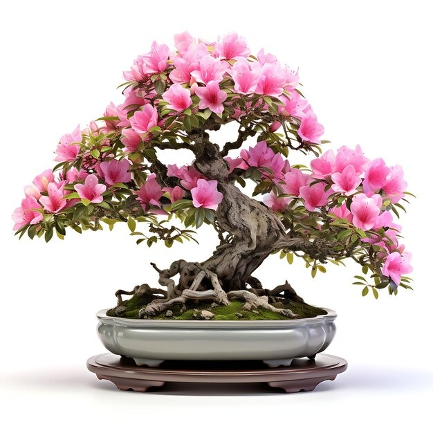

A flowering bonsai known for its vibrant and colorful blooms.

### 2. Blueberry Bonsai

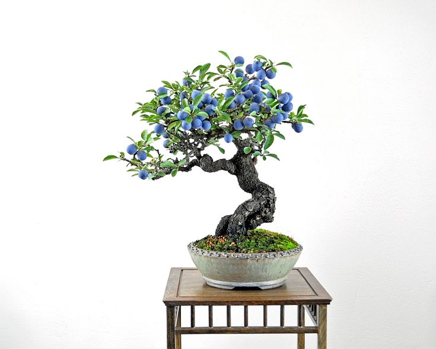

A fruit-bearing bonsai that produces small edible blueberries.

### 3. Bougainvillea Bonsai

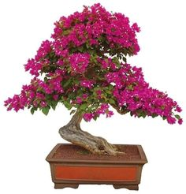

A tropical bonsai famous for its bright, paper-like flowers.

### 4. Chinese Elm Bonsai

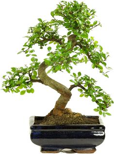

A popular beginner bonsai with small leaves and strong adaptability.

### 5. Dwarf Jade Bonsai

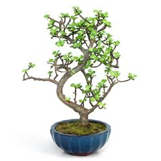

A succulent bonsai with thick leaves and excellent drought tolerance.

### 6. Ginseng Ficus Bonsai

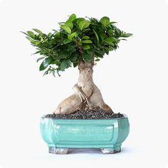

Recognized for its thick roots and glossy green leaves.

### 7. Hibiscus Bonsai Tree

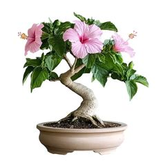

A flowering bonsai with large, vibrant blossoms.

### 8. Ixora Bonsai

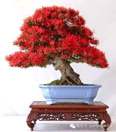

A tropical bonsai known for its clustered small flowers.

### 9. Japanese Flowering Cherry Bonsai

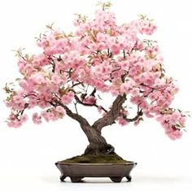

Famous for its delicate pink blossoms.

### 10. Japanese Maple Bonsai

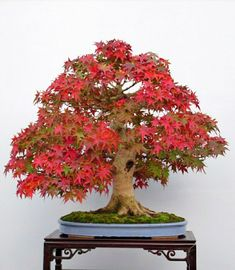

Known for its beautiful seasonal leaf color changes.

### 11. Juniper Bonsai

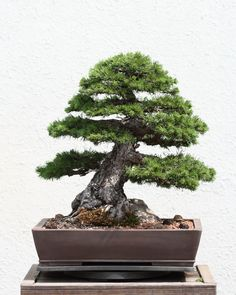

One of the most common bonsai types with needle-like foliage.

### 12. Kingsville Boxwood Bonsai

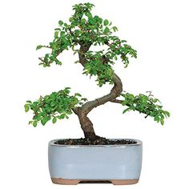

A compact bonsai with dense foliage.

### 13. Mimosa Bonsai

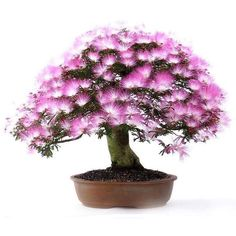

Known for its sensitive leaves that close when touched.

### 14. Orange Bonsai

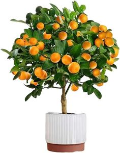

A fruit-bearing bonsai producing miniature oranges.

### 15. Persimmon Bonsai

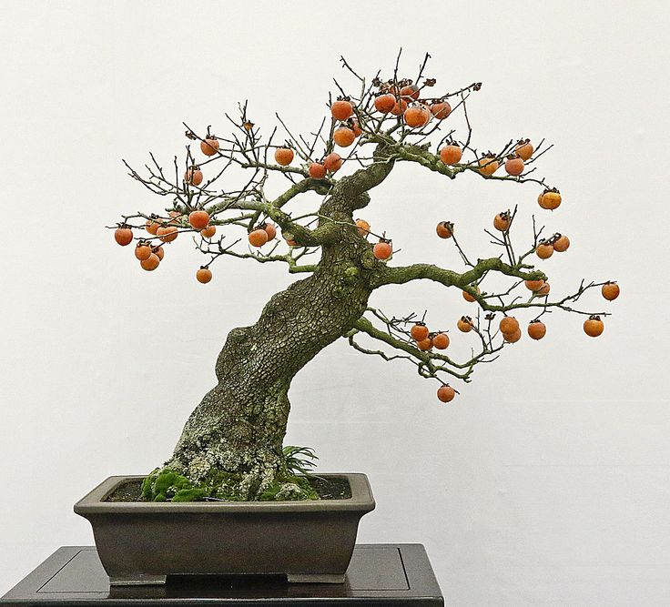

Produces small orange fruits and has seasonal leaf changes.

### 16. Pine Bonsai

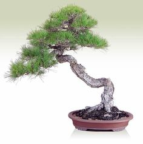

A classic bonsai with needle-like leaves and rugged form.

### 17. Pomegranate Bonsai

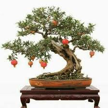

A flowering and fruiting bonsai with bright red blossoms.

### 18. Trident Maple Bonsai

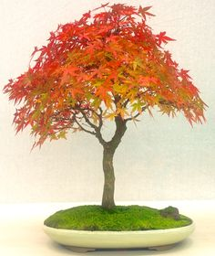

Known for its strong roots and beautiful autumn colors.

### 19. White Oak Bonsai

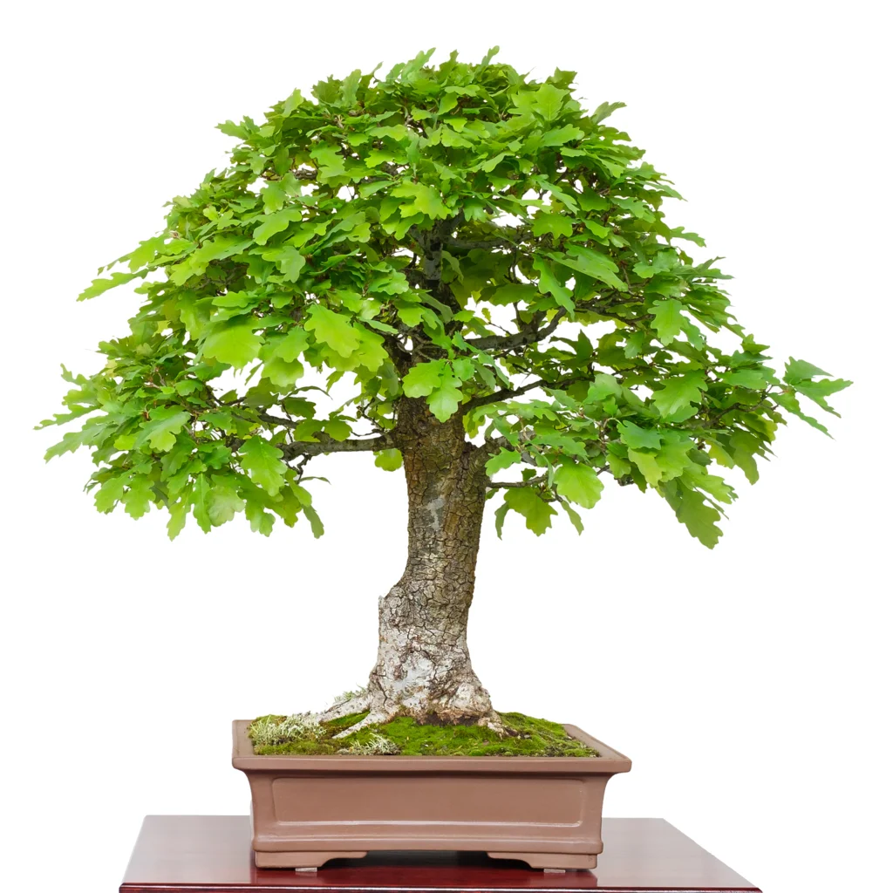

A sturdy bonsai with lobed leaves and strong trunk.

### 20. Wisteria Bonsai

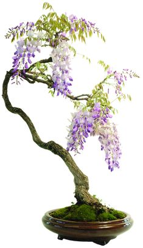

Famous for its hanging purple flower clusters.

---

## ⚙️ Section C: Model Training Details
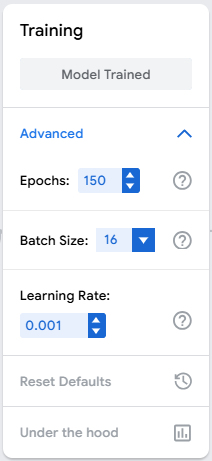
* **Epochs:** 150
* **Batch Size:** 16
* **Learning Rate:** 0.001
* **Images per class:** ~250
* **Total dataset size:** ~5000 images

These values were selected to balance training efficiency and model accuracy. Increasing epochs allows better learning, while a moderate batch size ensures stable updates.

---

## 📊 Section D: Model Evaluation

### Confusion Matrix

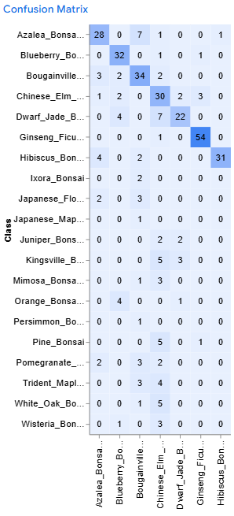
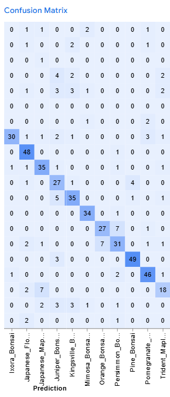
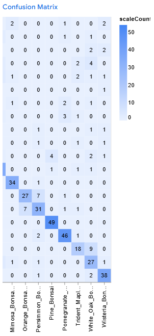

### Accuracy per Class

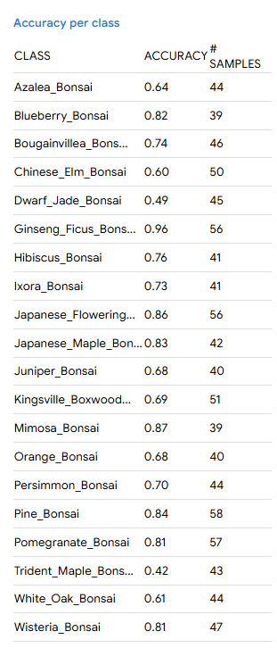

### Overall Accuracy

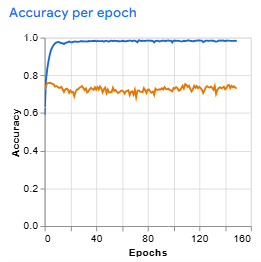

The confusion matrix shows that most bonsai species were correctly classified, although some visually similar species caused minor misclassifications.

---

## 🧪 Section E: Model Testing

Below are sample test results from the Teachable Machine Preview:

### Test 1
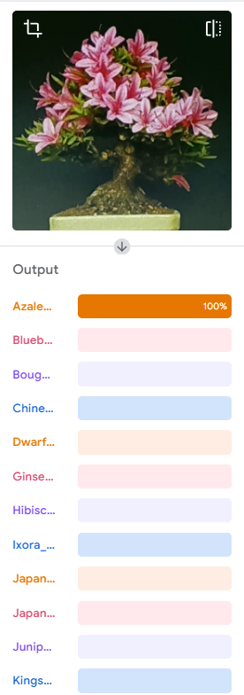

### Test 2
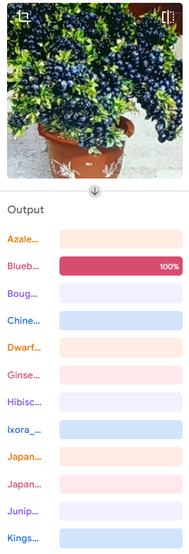

### Test 3
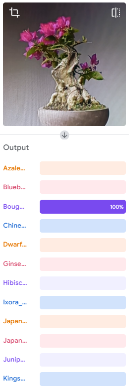

### Test 4
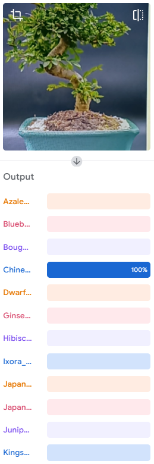

### Test 5
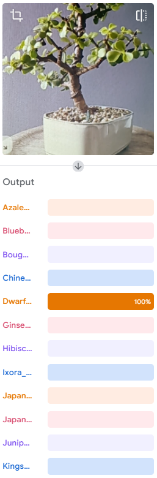

### Test 6
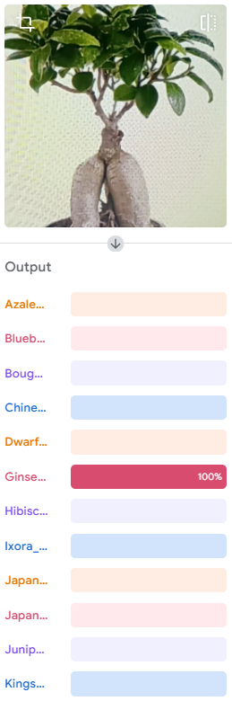

### Test 7
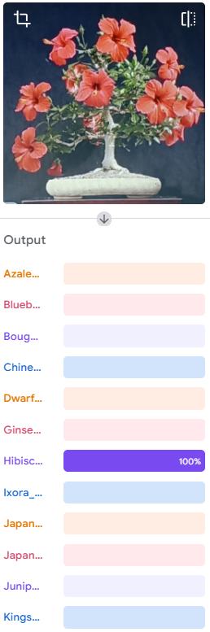

### Test 8
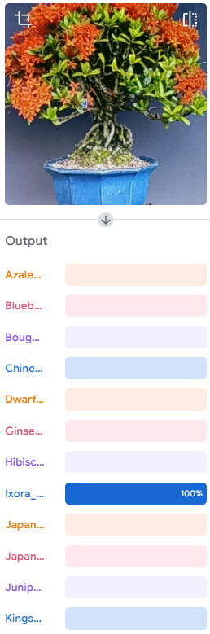

### Test 9
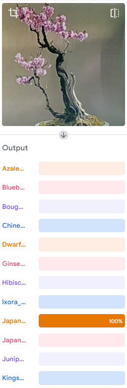

### Test 10
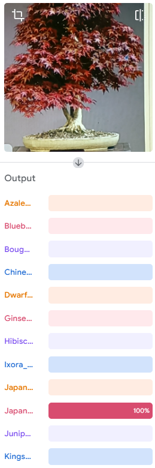

### Test 11
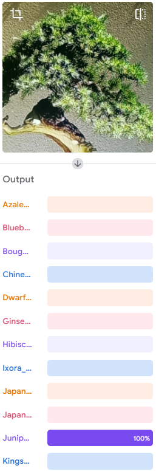

### Test 12
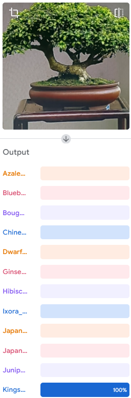

### Test 13
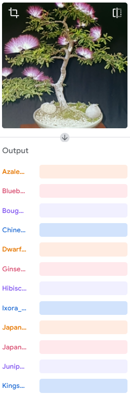
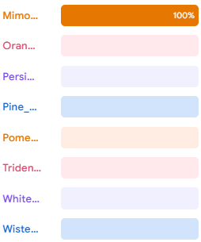

### Test 14
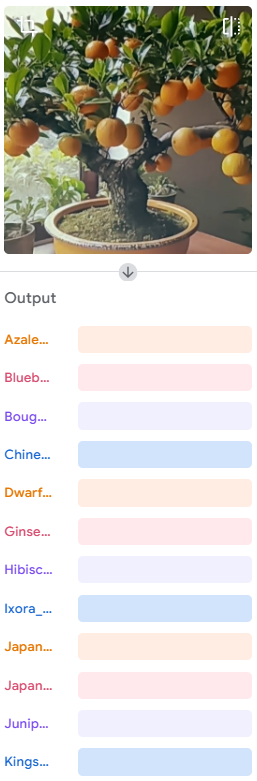
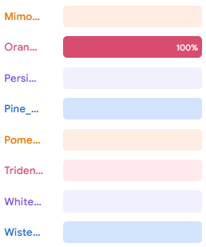

### Test 15
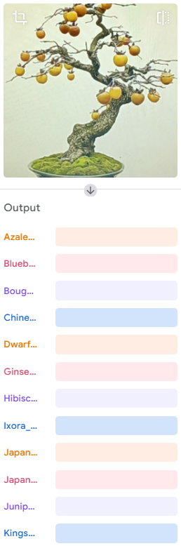
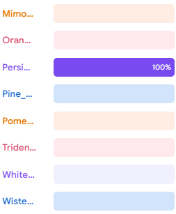

### Test 16
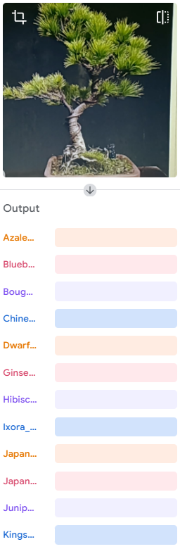
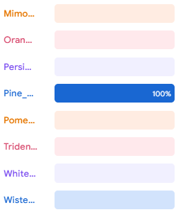

### Test 17
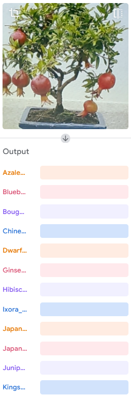
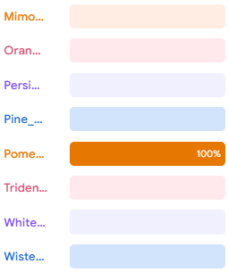

### Test 18
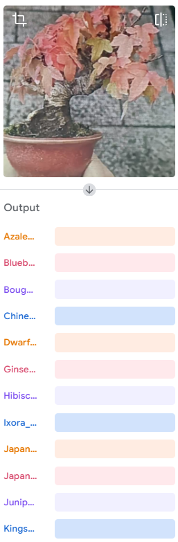
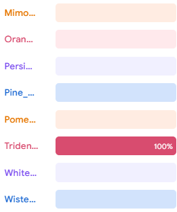

### Test 19

### Test 20

## 📦 Model Export

The trained model was exported using TensorFlow format and stored in the [`models/`](models/) folder.

---

## ✅ Submission Checklist

* ✔️ **20 related plant species proposed**
  See **Section B: Plant Species Overview** for details.

* ✔️ **Minimum 250 images per species**
  Images are stored in the [`images/`](./images) folder.

* ✔️ **Model trained using Teachable Machine**
  Training details are in **Section C: Model Training Details**.

* ✔️ **Under-the-hood evaluation screenshots**
  Confusion matrix, per-class accuracy, and overall accuracy are in **Section D: Model Evaluation**.

* ✔️ **10 preview testing screenshots**
  See **Section E: Model Testing** for all screenshots.

* ✔️ **Model exported and saved**
  Exported model files are in the [`models/`](./models) folder.

* ✔️ **GitHub repository with complete README.md**
  You are currently viewing it here! ✅

* ✔️ **All files and screenshots uploaded and documented**
  Check the following folders for completeness:

  * [`images/`](./images)
  * [`models/`](./models)

---

## 🧠 Reflection

**1. How did the number of images per class affect your model’s accuracy?**
  * The number of images per class significantly affected the model’s performance. Classes with more balanced and higher-quality images, such as Ginseng Ficus Bonsai (96%) and Pine Bonsai (84%), achieved higher accuracy. In contrast, classes with fewer or less consistent images, such as Dwarf Jade Bonsai (49%) and Trident Maple Bonsai (42%), showed lower accuracy. This indicates that having more diverse and well-distributed images improves the model’s ability to generalize.

---

**2. Which plant species were most commonly misclassified and why?**
  * Some species were frequently misclassified due to visual similarities in leaf shape and structure. For example, Trident Maple Bonsai (42%) and Dwarf Jade Bonsai (49%) had lower accuracy because their features are similar to other bonsai species. Additionally, White Oak Bonsai (61%) and Azalea Bonsai (64%) also showed confusion with other classes. These misclassifications occurred because the model struggled to distinguish subtle differences between similar-looking plants.

---

**3. How did changing the epochs, batch size, or learning rate affect the training results?**
  * Increasing the number of epochs (150) allowed the model to learn more patterns from the dataset, improving accuracy for several classes. The batch size of 16 helped maintain stable training without overwhelming the system. The learning rate of 0.001 ensured gradual learning and prevented the model from overshooting optimal values. Overall, these parameters provided a balance between training time and performance, though further tuning could improve weaker classes.

---

**4. What challenges did you encounter during dataset collection and labeling?**
  * One of the main challenges was collecting a large number of high-quality images for each plant species. It was difficult to find images with consistent angles, lighting, and clarity. Another challenge was avoiding duplicate or mislabeled images, which could negatively affect model accuracy. Ensuring that each class had balanced and diverse data required significant time and effort.

---

**5. If you were to improve your model, what specific changes would you make and why?**
  * To improve the model, I would increase the number of images for low-performing classes such as Trident Maple Bonsai and Dwarf Jade Bonsai. I would also ensure better image quality and diversity (different angles, lighting, and backgrounds). Additionally, I would experiment with adjusting training parameters such as increasing epochs further or fine-tuning the learning rate. These improvements would help the model better distinguish between visually similar bonsai species and increase overall accuracy.

---

